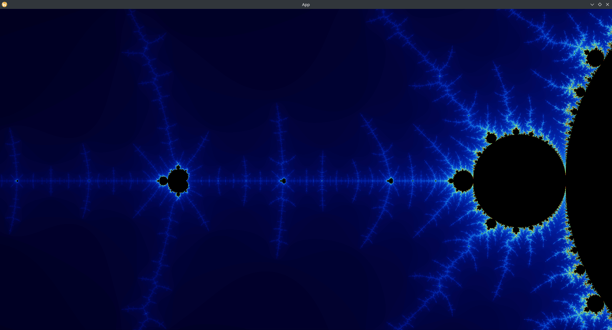

# Introduction

Rendering fractals such as the Mandelbrot set using the [Bevy](https://bevy.org/) framework in [Rust](https://www.rust-lang.org/).



# Dependencies

[Install the necessary dependencies](https://bevy.org/learn/quick-start/getting-started/setup/#installing-os-dependencies) depending on your system. On Arch Linux, I am using PipeWire for audio, and have AMD Radeon RX 6600 graphics card for rendering. Thus, installing the following packages:

```bash
sudo pacman -S libx11 pkgconf alsa-lib pipewire-alsa vulkan-radeon
```

# Usage

Run with release mode for better performance:

```bash
cargo run --release
```

Interactions:
- Use the mouse wheel to zoom in and out
- Click and drag the mouse to change view
